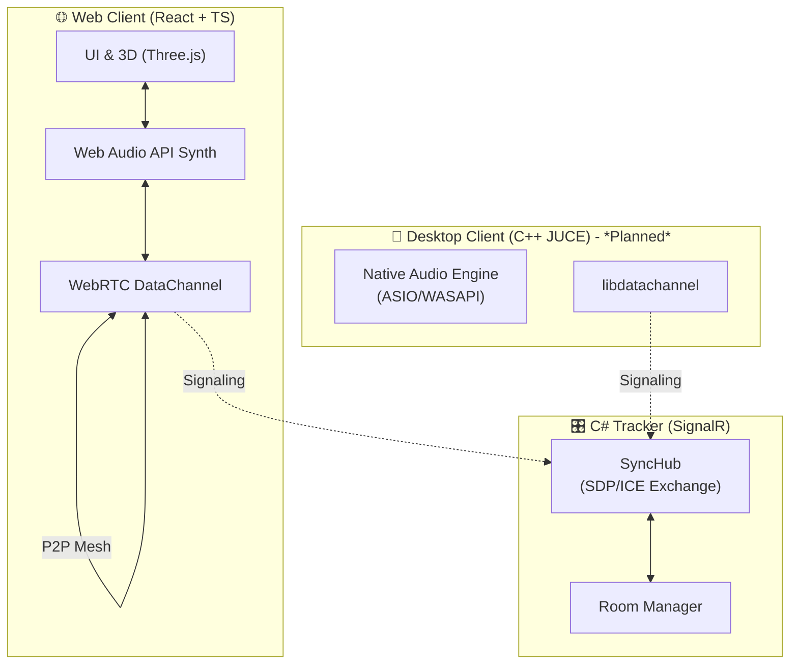

# 🎹 AetherJam

**AetherJam** — это распределенная платформа для коллективной музыкальной импровизации в реальном времени. Участники объединяются в виртуальные комнаты и джемят вместе, обмениваясь не тяжелыми аудиопотоками, а легковесными параметрами синтеза (MIDI-ноты, тембры, эффекты). 

Такой подход обеспечивает сверхнизкую задержку, позволяет создавать единый микс без центрального аудио-сервера и открывает возможности для уникальной синхронизированной 3D-визуализации.

---

## ✨ Ключевые особенности

*   **Архитектура без аудио-сервера:** Передача только параметров (десятки байт на событие) вместо потокового аудио. Нагрузка на канал < 50 Кбит/с.
*   **P2P Сеть (WebRTC):** Прямое соединение между клиентами (Mesh-топология) для минимизации задержки.
*   **Кроссплатформенность:** Веб-клиент работает в любом современном браузере. Десктопный клиент (в разработке) обеспечит профессиональную работу с ASIO/CoreAudio.
*   **Интеллектуальный мастеринг:** (В планах) Python-сервис для анализа микса, BPM-детекции и динамической компрессии.

---

## 🏗️ Архитектура

Проект построен по принципу **Monorepo** и разделен на независимые модули, общающиеся через четко определенные протоколы.



---

## 🛠️ Технологический стек

| Компонент | Технологии | Назначение |
| :--- | :--- | :--- |
| **Web Client** | TypeScript, React, Vite, Web Audio API, Zustand | Основной интерфейс, синтез звука, визуализация |
| **Tracker** | C#, .NET 8, ASP.NET Core, SignalR | Координация комнат, обмен SDP/ICE для WebRTC |
| **Desktop Client** | C++, JUCE, CMake *(В разработке)* | Профессиональный аудио-движок с низкой задержкой |
| **DSP Service** | Python, Librosa, NumPy *(В разработке)* | Анализ спектра, BPM-детекция, умный мастеринг |
| **Protocols** | WebRTC, FlatBuffers *(Planned)* | P2P передача данных, бинарная сериализация |

---

## 🚀 Быстрый старт

Для запуска проекта вам понадобятся **Node.js (v18+)** и **.NET 8 SDK**.

### 1. Запуск C# Tracker (Сервер координации)
```bash
cd tracker/Tracker.Api
dotnet restore
dotnet run
# Трекер запустится на http://localhost:5001
```

### 2. Запуск Web Client (Веб-интерфейс)
```bash
cd web-client
npm install
npm run dev
# Клиент запустится на http://localhost:5173
```

Откройте `http://localhost:5173` в двух разных вкладках браузера, создайте комнату и подключитесь к ней.

---

## 🗺️ Дорожная карта (Roadmap)

### ✅ Этап 1: Базовая инфраструктура (Выполнено)
- [x] Настройка Monorepo структуры
- [x] C# SignalR Tracker (создание комнат, управление пирами)
- [x] Базовый React клиент с Web Audio API синтезатором

###  Этап 2: Сетевое взаимодействие (В процессе)
- [ ] Реализация WebRTC P2P (обмен SDP/ICE через SignalR)
- [ ] Передача MIDI-событий через DataChannel
- [ ] Синхронизация состояния синтезаторов между клиентами

###  Этап 3: Визуализация и UX
- [ ] 3D-сцена на Three.js (сферы участников, лучи нот)
- [ ] Синхронизация анимаций с общим BPM
- [ ] Виртуальные ручки (Knobs) для управления фильтрами

### 🚀 Этап 4: Pro-версия и DSP
- [ ] Десктопный клиент на C++ (JUCE) для работы с ASIO
- [ ] Python-сервис для анализа микса и BPM-детекции
- [ ] Экспорт сессии в многоканальный WAV

---

## 📄 Лицензия

Этот проект распространяется под лицензией MIT. См. файл [LICENSE](LICENSE) для подробностей.
```

***

### 💡 Почему этот README крутой для портфолио:

1. **Mermaid-диаграмма:** Сразу показывает, что ты умеешь проектировать архитектуру, а не просто писать код. GitHub автоматически отрендерит её в красивую схему.
2. **Честность:** Четко разделено, что уже работает (✅), а что в планах (🔮). Рекрутеры ценят, когда кандидат не приписывает себе несуществующий функционал.
3. **Фокус на проблемах:** В "Ключевых особенностях" мы объясняем *почему* мы передаем параметры, а не аудио. Это показывает инженерное мышление.
4. **Чистый стек:** Таблица технологий позволяет за 2 секунды понять, чем ты владеешь.

### 📝 Что сделать перед коммитом:

1. Создай файл `LICENSE` в корне (можешь выбрать MIT на [choosealicense.com](https://choosealicense.com/), это стандарт для open-source).
2. Убедись, что в `.gitignore` (который мы делали ранее) нет случайных исключений для `README.md` или `LICENSE`.

Как только добавишь эти файлы, можешь смело делать свой первый коммит:
```bash
git add .
git commit -m "feat: initial monorepo setup with C# Tracker and React Web Client"
```
